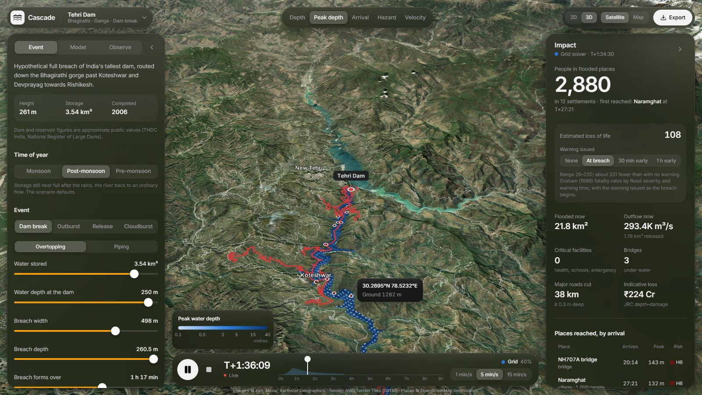
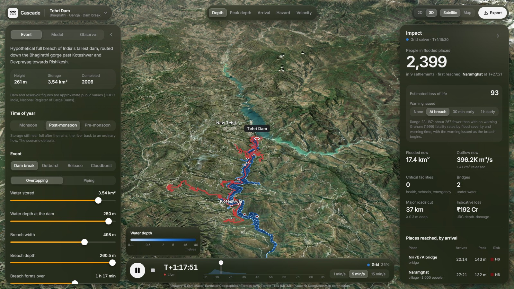
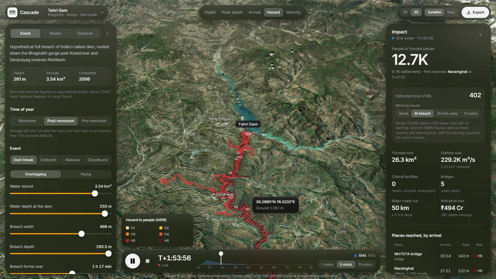

<div align="center">


# Cascade

**What happens when a dam fails — mapped, timed and counted, in a browser tab.**

Two independent hydrodynamic solvers, real terrain, real settlements, and an honest account of what the model does not know.

[](https://nextjs.org)
[](https://www.typescriptlang.org)
[](https://deck.gl)
[](https://developer.mozilla.org/docs/Web/API/WebGPU_API)
[](#why-this-exists)



</div>

---

## Why this exists

India has more than 6,000 large dams, many of them above towns that have grown up in the valley below. Built for Smart India Hackathon problem statement **SIH26161** (National Technical Research Organisation) — *Dam Break Inundation Modelling Using Hydrodynamic Modelling of any River* — Cascade answers the questions a district administration actually has to answer, in the ten minutes it has to answer them:

> **How much water leaves? Where does it go? When does it get here? How deep, how fast — and who is standing in it?**

Everything runs client-side. No server, no licence, no install: open the page and the flood computes on the machine in front of you.

---

## What it does

| | |
|---|---|
| **Two solvers, side by side** | A 2D shallow-water finite-volume solver (HLL, wetting/drying) and an SPH particle solver compute the same flood two different ways. Where they agree, the answer does not depend on the choice of method; where they differ, the gap *is* the model uncertainty — drawn on the map as the **Difference** layer and scored by critical success index. |
| **Four kinds of event** | Dam break · glacial-lake / landslide-dam outburst · controlled gated release · **cloudburst**, where rain falls on every cell of the basin and runs off downhill — a flash flood with nothing failing. |
| **Real terrain, in 3D** | SRTM elevation stitched to zoom 17 with satellite imagery draped over it, and the flood shaded on the water surface itself — built to stay fluid on a laptop's integrated graphics. |
| **Who is in the way** | Settlements, hospitals, schools, bridges and roads from OpenStreetMap, counted as the water reaches them: people exposed, arrival time per place, AIDR **H1–H6** hazard classes, roads cut, indicative damage, and loss of life with and without warning. |
| **Checked against reality** | Import a Sentinel-1 observed flood extent and score the model against it (CSI, hit rate, false-alarm ratio), or a maximum-depth raster from Delft3D or HEC-RAS and compare depth RMSE cell by cell. |
| **Answers you can carry out of the room** | KML · zipped Shapefile · GeoJSON · ESRI ASCII rasters · an evacuation CSV sorted by arrival · a CAP 1.2 alert in English and Hindi · and a **printable one-page brief** with the map, the figures and the assumptions behind them. |

---

## Two solvers, one flood

<table>
<tr>
<td width="50%"></td>
<td width="50%"></td>
</tr>
<tr>
<td><b>Depth, live.</b> The playhead trails the solver while it computes, so the flood plays out as it is worked out.</td>
<td><b>Hazard, AIDR H1–H6.</b> Depth × velocity, the measure of what water does to a person standing in it.</td>
</tr>
</table>

**Grid solver** — finite-volume shallow-water equations with an HLL Riemann solver, per-row wet-span tracking, implicit Manning friction and a drowned-breach boundary. Runs as WGSL on the graphics card where that is faster, otherwise in a Web Worker. Both paths are built from one `EngineConfig`, so they can never drift apart.

**SPH solver** — the same shallow-water physics on tens of thousands of moving parcels of water. No grid, so no smeared wet–dry front; it fails differently, which is the point of running it.

**Which one runs where** is measured, not assumed: at the start of a run both solvers are given the same opening slice and the loser is dropped. On a laptop's integrated graphics the processor usually wins by a wide margin, and Cascade says so in **Model → This device**.

---

## The physics, and where it comes from

| Step | Method | Source |
|---|---|---|
| Breach geometry & formation time | Regression on reservoir volume and dam height | Froehlich (2008) |
| Outflow | Level-pool routing through a broad-crested trapezoidal weir, drowned by the live tailwater | — |
| Peak-outflow cross-check | Qp = 0.607 · Vw^0.295 · Hw^1.24 | Froehlich (1995) |
| Flood routing | 2D shallow-water equations, finite volume, HLL flux | Toro; Delft3D-FLOW in 2D |
| Roughness | Manning's *n*, per cell where land cover is known | — |
| Hazard to people | Depth × velocity classes H1–H6 | AIDR (2017) |
| Damage | Global depth–damage curves for Asia, at Indian replacement values | JRC |
| Loss of life | Fatality rates by flood severity and warning time | Graham (1999) |
| Uncertainty | Latin-hypercube ensemble over breach width, formation time and roughness | Wahl (2004) scatter |
| Observed extent | Sentinel-1 VV/VH change detection | UN-SPIDER recommended practice |

Terrain: AWS Open Data Terrain Tiles (SRTM, NASA/USGS) · Exposure: © OpenStreetMap contributors (ODbL) · Imagery: Esri, Maxar, Earthstar Geographics · Radar: Copernicus / ESA via Google Earth Engine.

<details>
<summary><b>How this maps to the SIH26161 deliverables</b></summary>

| Deliverable | In Cascade | Where on screen |
|---|---|---|
| Generalised framework for dam break / river blockage, sudden surge, loss & damage | Breach hydrograph from reservoir routing (Froehlich 2008 breach, weir flow, tailwater submergence) feeding two hydrodynamic solvers; AIDR H1–H6 hazard, JRC depth–damage losses, loss of life from Graham (1999) with and without warning, per-place arrival times | **Event** tab; **Impact** panel; **Hazard** and **Arrival** layers |
| SPH and Delft3D models, compared | SPH-SWE particle solver and a 2D shallow-water finite-volume solver (the physics of Delft3D-FLOW in 2D) run side by side and compared by critical success index, depth difference and flooded area over time; real Delft3D / HEC-RAS rasters can be imported and compared too | **Grid / SPH / Both** switch; **Difference** layer; **Model → Compare runs** |
| A model a jury can trust | Analytical benchmarks run live in the browser: Ritter (dry bed), Stoker (wet bed bore), lake at rest over rough terrain, and the mass balance of the run just computed | **Model → Method and validation** |
| Scenarios from different input datasets | Scenario builder for any Indian dam: SRTM fetched automatically or upload GeoTIFF / ASCII (CartoDEM, ASTER, SRTM); exposure from OpenStreetMap or uploaded GeoJSON; crest line and river path found automatically | Dam name → *New scenario for any river…* |
| Dashboard; large data; .shp / .kml output | Whole dashboard; grid solver on WebGPU or a Web Worker; rendering scales to ~400k cells; exports KML, zipped Shapefile, GeoJSON, ESRI ASCII rasters, evacuation CSV, CAP 1.2 alert and a printable brief | **Export** |
| Near-real-time flood analysis through Google Earth Engine | Generates a Sentinel-1 change-detection script (UN-SPIDER method) for the open scenario; `scripts/gee/nrt_flood.py` runs it headless; the observed extent is imported and scored against the model | **Observe** tab |
| Demonstrate on real Indian river and dam data | Tehri, Bhakra, Machchhu 1979 and Rishi Ganga bundled with SRTM terrain and OpenStreetMap exposure | Dam name, top left |

</details>

---

## Run it

Install [Node.js](https://nodejs.org) (LTS), then:

```bash
npm install
npm run demo      # optimised build + server — use this to present
npm run dev       # hot reload, slower rendering
```

The dashboard is at `http://localhost:3000`. Bundled scenarios work offline once built; imagery, the scenario builder, OpenStreetMap and Earth Engine need a connection.

**One click instead:** double-click `start.cmd` (Windows) or run `./start.sh` (macOS / Linux).

**Browsers:** current Chrome, Edge, Firefox or Safari 16.4+ with hardware acceleration. The map needs WebGL 2; the solvers run in Web Workers, with WebGPU used for the grid solver when it wins the race.

### Verify the physics yourself

```bash
npm run verify                  # Ritter and Stoker dam breaks against their analytical solutions,
                                # momentum over an obstruction (EA test 3), lake at rest, mass balance,
                                # then Tehri end to end on both solvers
npm run verify -- bhakra --swe  # one scenario, grid solver only
```

Every check prints its error against the exact solution — mass conservation lands around 1e-12 %, the Stoker bore within 0.6 % of its exact position, and the Ritter front within 9 % on 10 m cells.

---

## Bundled scenarios

**Tehri** (Bhagirathi–Ganga, Uttarakhand) · **Bhakra** (Sutlej, Himachal Pradesh) · **Machchhu II, 1979** (Gujarat — the real failure that killed thousands at Morbi) · **Rishi Ganga lake outburst, 2021** (Chamoli).

Or build your own for any Indian dam: a searchable catalogue of **144 dams across 30 states**, the dam's crest line read from OpenStreetMap, SRTM terrain fetched and cached automatically, and OpenStreetMap exposure for the reach — or upload your own DEM (GeoTIFF / ASCII: CartoDEM, ASTER, SRTM) and exposure GeoJSON.

---

## Repository layout

```
src/simulation/   solvers (swe, sph, sweGpu), runtime, breach hydrograph, setup, exposure sampling
src/components/   dashboard, map layers and shaders, panels
src/lib/          geometry, analytics, export formats (KML/SHP/GeoJSON/raster/CAP/brief), motion
scripts/          scenario builder, engine verification, Earth Engine scripts, benchmarks
public/scenarios/ bundled scenarios with their DEMs and exposure
docs/             architecture, data pipeline, handover notes
```

[docs/ARCHITECTURE.md](docs/ARCHITECTURE.md) · [docs/DATA_PIPELINE.md](docs/DATA_PIPELINE.md)

---

## What this is not

Cascade is a planning and exercise tool, not a forecast and not an official warning. Channels, embankments and culverts narrower than one grid cell are not resolved, the terrain carries no river bathymetry, and dam figures are approximate public values — verify with the dam owner before any operational use. Depths, arrival times and losses are indicative, and the interface says so wherever it shows a number.

<div align="center">

Built by [**sirgreaseball**](https://github.com/sirgreaseball) · Smart India Hackathon 2026

</div>
